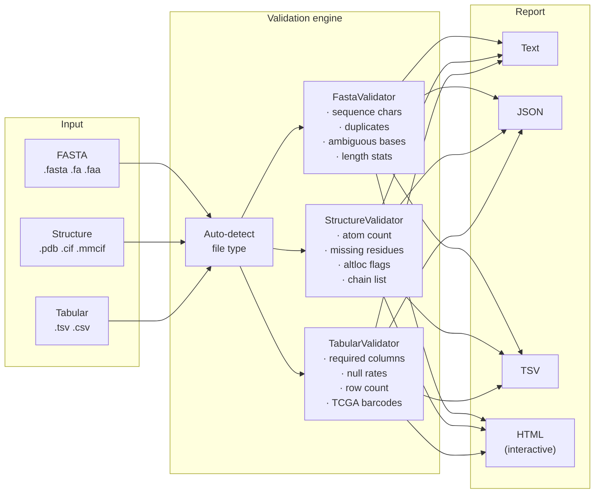

# BioCheck

[](LICENSE)
[](https://www.python.org/)
[](#supported-formats)

Validate biological files before using them. Supports FASTA, PDB, mmCIF, TSV, and CSV. Outputs plain text, JSON, or interactive HTML reports.

---

## How it works



---

## What gets validated

### FASTA files
| Check | Severity |
|---|---|
| Valid characters for DNA / RNA / protein (IUPAC) | ERROR |
| Empty sequences | ERROR |
| Duplicate sequence IDs | ERROR |
| Ambiguous characters (N, X, B, Z…) | WARNING |
| Very short sequences (< 10 bp/aa) | WARNING |
| Molecule type auto-detection | INFO |

### Structure files (PDB / mmCIF)
| Check | Severity |
|---|---|
| File parseable by Biopython | ERROR |
| Zero atoms | ERROR |
| Missing residues (gaps in numbering) | WARNING |
| Alternate conformations (altloc) | WARNING |
| Multi-model structures (NMR / trajectories) | INFO |

### Tabular files (TSV / CSV)
| Check | Severity |
|---|---|
| Required columns present (built-in profiles: gtex, hpa, string, gdc) | ERROR |
| Columns that are entirely empty | ERROR |
| High null rate per column (> 20%) | WARNING |
| Completely empty rows | WARNING |
| TCGA barcode format (auto-detected) | WARNING |
| Row count within expected range | ERROR / WARNING |

---

## HTML report

The `biocheck report` command validates multiple files at once and produces a single self-contained HTML file — no server, no external dependencies, works offline.

```
┌──────────────────────────────────────────────────┐
│  BioCheck Validation Report                      │
│  Generated 2026-03-22 · 4 files validated        │
│                                                  │
│  [ 2 PASS ]  [ 1 WARN ]  [ 1 FAIL ]             │
│                                                  │
│  ▶  PASS  vdac1.fasta        FASTA (PROTEIN)    │
│  ▶  PASS  2JK4.cif           mmCIF              │
│  ▶  WARN  gtex.tsv           TSV  1 warning     │
│  ▶  FAIL  hspa9.fasta        FASTA  1 error     │
└──────────────────────────────────────────────────┘
```

Each row expands to show full statistics and issue details.

---

## Installation

```bash
pip install biocheck
```

---

## Usage

### GUI (drag and drop)
```bash
biocheck gui
```

### CLI — single file
```bash
biocheck fasta sequences.fasta
biocheck structure protein.cif
biocheck table gtex_expression.tsv --profile gtex
```

### CLI — batch HTML report
```bash
biocheck report *.fasta *.cif *.tsv --output report.html
```

### Python library
```python
from biocheck import FastaValidator, StructureValidator, TabularValidator
from biocheck.core.html_report import render_html

# Validate a FASTA file
report = FastaValidator().validate("sequences.fasta")
print(report.is_valid)    # True / False
print(report.warnings)    # list of Issue objects
print(report.stats)       # {"sequences": 5, "min_length": 120, ...}

# Validate a structure
report = StructureValidator().validate("protein.cif")

# Validate a tabular file with a built-in profile
report = TabularValidator().validate("gtex.tsv", profile="gtex")

# Generate a combined HTML report
render_html([report1, report2, report3], "report.html")
```

---

## Built-in profiles for tabular files

| Profile | Source | Required columns |
|---|---|---|
| `gtex` | GTEx expression data | `tissueSiteDetailId`, `median`, `unit`, `geneSymbol` |
| `hpa` | Human Protein Atlas | `gene`, `uniprot` |
| `string` | STRING interactions | `preferredName_A`, `preferredName_B`, `score` |
| `gdc` | GDC / TCGA files | `file_id`, `file_name`, `data_type`, `data_format` |

---

## Part of the Bio* ecosystem

BioCheck is designed to integrate seamlessly with other tools in the same ecosystem:

```
BioFetch  →  downloads data from 8 public databases
BioCheck  →  validates downloaded or locally generated files   ← you are here
BioReads  →  QC and alignment for NGS sequencing data
```

---

## License

MIT — free to use, modify, and distribute with attribution.
See [LICENSE](LICENSE) for details.
